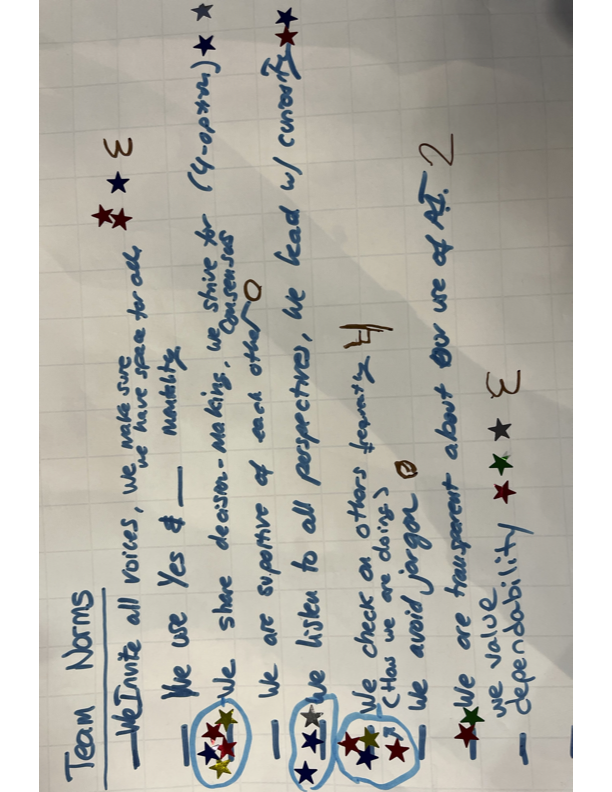
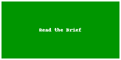
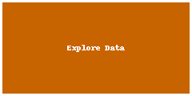

# Cross-Cutting Data Interoperability & Harmonization Innovation Summit 2025 — Group 18

<a href="https://github.com/CU-ESIIL/cross-cutting-data-interoperability-harmonization-innovation-summit-2025__18/edit/main/docs/index.md" title="Edit this page">✏️</a>

---

<!DOCTYPE html>
<html lang="en">
<head>
    <meta charset="UTF-8">
    <meta name="viewport" content="width=device-width, initial-scale=1.0">
    <title>ESIIL Group 18: From Data Chaos to Community Standards</title>
    
</head>
<body>
    

        <header class="hero">
            <h1>From Data Chaos to Community Standards</h1>
            
ESIIL Group 18's Journey Through the Metadata Maze

            
"Data usefulness goes down with time while costs go up — where's the sweet spot? We're finding out."

        </header>
        
        <main class="content">
            <section class="section">
                <h2>Our Journey: Navigating the Groan Zone</h2>
                

                    Two intensive days, 9 environmental scientists, one big challenge: making data work better for everyone.
                

                
                

                    

                        <h3>🎯 Day 1: The Big Picture Problem</h3>
                        
We started with grand ambitions—tackle all the data interoperability challenges in environmental science! But reality hit: we couldn't write a meaningful paper without understanding what researchers actually do with their data.

                    

                    
                    

                        <h3>🤔 The Realization</h3>
                        
Hurricane path data scattered across federal sources. Agricultural sampling methods buried in cryptic metadata. eDNA methods changing faster than we could keep up. The problem wasn't abstract—it was personal.

                    

                    
                    

                        <h3>💡 Day 2: The Strategic Pivot</h3>
                        
Instead of assuming solutions, we decided to ask the right questions first. What do researchers actually need? How do they currently handle metadata? What are the real barriers?

                    

                    
                    

                        <h3>🛠️ Evidence-Based Solutions</h3>
                        
Now we're building tools informed by real researcher needs: live polling at this summit, comprehensive post-event surveys, and practical guidelines for OASIS that actually work in the field. This evidence gathering is directly informing our perspectives paper for Environmental Data Science.

                    

                

            </section>
            
            

                <h3 style="color: #2d3748; margin-bottom: 20px; font-size: 1.8rem;">From Divergent Thinking to Convergent Action</h3>
                
We embraced the "Groan Zone" — that uncomfortable but creative space between brainstorming and decision-making.

                
                

                    

                        <h4>Divergent Ideas</h4>
                        
Best practices, training materials, repository audits, improving current repositories, creating ESIIL-Zenodo communities, developing data cube standards, AI tools for metadata generation — we explored everything

                    

                    

                        <h4>Groan Zone</h4>
                        
Frustration led to breakthrough: we need data before prescribing solutions, we need to study the weaknesses of current initiatives, we can actually work on a solution to OASIS

                    

                    

                        <h4>Convergent Action</h4>
                        
Tools to gather information, write a perspective paper, create resources for researchers

                    

                

            

            
            

                "Data on its own is not inherently useful — you need metadata and context. There's no problem that's not interdisciplinary, so it would be better if it wasn't so hard and time-intensive to collaborate."
                

                    — heard in our discussion sessions
                

            

            
            <section class="section">
                <h2>What We're Building</h2>
                

                    

                        <h4>📊 Live Community Polling</h4>
                        
Right here at the summit — understanding how you identify datasets, what barriers you face, and where the biggest pain points lie in data discoverability.

                        Active Now
                    

                    
                    

                        <h4>📝 Comprehensive Post-Survey</h4>
                        
Detailed follow-up exploring metadata practices, repository usage, interoperability challenges, and time spent on data preparation across disciplines.

                        Coming Soon
                    

                    
                    

                        <h4>📑 Call-to-Action Paper</h4>
                        
Evidence-based recommendations for Environmental Data Science journal, targeting spring 2026 publication with concrete, actionable standards.

                        Spring 2026
                    

                    
                    

                        <h4>🔧 OASIS Integration</h4>
                        
Practical metadata guidelines and tools integrated into ESIIL's Open Analysis and Synthesis Infrastructure, making standards accessible where researchers actually work.

                        In Development
                    

                

            </section>
            
            <section class="section">
                <h2>Why This Matters</h2>
                

                    

                        <h3>🔍 The Hidden Time Sink</h3>
                        
Researchers spend hours, days, even weeks hunting for datasets and preparing them for analysis. Imagine if that time could be spent on actual discovery instead.

                    

                    
                    

                        <h3>🌐 The Interdisciplinary Imperative</h3>
                        
Climate change doesn't respect disciplinary boundaries. Hurricane impacts involve meteorology, ecology, sociology, economics, and more. Our data should connect as easily as the problems do.

                    

                    
                    

                        <h3>🚀 Future-Proofing Science</h3>
                        
We can't predict what our data will be useful for in the future, but we can ensure it's equipped to be discovered, understood, and reused by the next generation of researchers.

                    

                

            </section>
            
            

                <h3 style="text-align: center; margin-bottom: 20px; color: #2d3748; font-size: 1.8rem;">Our Team Values in Action</h3>
                

                    

                        🎤
                        <h4>All Voices Welcome</h4>
                        
We invite perspectives from every discipline

                    

                    

                        🤝
                        <h4>Consensus-Building</h4>
                        
We strive for solutions everyone can support

                    

                    

                        👂
                        <h4>Active Listening</h4>
                        
Every perspective leads with curiosity

                    

                    

                        🔍
                        <h4>Evidence-Based</h4>
                        
We check our assumptions with real data

                    

                    

                        🤖
                        <h4>AI-Transparent</h4>
                        
We're open about how we use AI tools

                    

                    

                        ⚖️
                        <h4>Dependable</h4>
                        
We deliver on our commitments

                    

                

            

            
            <section class="section">
                <h2>Our Unique Approach</h2>
                

                    While most FAIR data initiatives create complex standards that are "challenging for typical researchers to understand and implement," we're taking a different path:
                

                
                

                    

                        <h3>🏥 Learning from Success Stories</h3>
                        
<strong>ESS-DIVE shows what's possible:</strong> high-quality standards, clear templates, rigorous quality control. We're studying what makes them successful and how to apply those lessons elsewhere.

                    

                    
                    

                        <h3>👥 Community-Centric Design</h3>
                        
<strong>Researchers first, standards second:</strong> Instead of top-down mandates, we're building from the ground up, understanding actual workflows and pain points.

                    

                    
                    

                        <h3>🔬 Evidence-Based Development</h3>
                        
<strong>Data about data practices:</strong> Our surveys and polls aren't just consultation — they're research that will inform practical, adoptable solutions.

                    

                    
                    

                        <h3>🛠️ Implementation-Ready Tools</h3>
                        
<strong>From theory to practice:</strong> Our OASIS integration ensures recommendations become accessible tools in researchers' actual workflows.

                    

                

            </section>
        </main>
        
        <section class="cta-section">
            <h2>Join the Conversation</h2>
            

                Your experience matters. Help us understand the real challenges and build better solutions.
            

            <a href="#" class="cta-button">Take Our Live Poll</a>
            <a href="#" class="cta-button">Join the Follow-up Survey</a>
            

                Together, we're not just managing data — we're accelerating discovery.
            

        </section>
    

</body>
</html>

---

## Day 1 — Define & Explore
*Focus: questions, hypotheses, context; add at least one visual (photo of whiteboard/notes).*

### Our product 📣
-A call to action for broader community change/standards
- a paper for standards in metadata to future-proof data to ensure future utility. We can't imagine what our data can be useful for in the future. How can we generalize across our disciplines? Maybe special issue Environmental Data Science, ideas by Nov 2025, full article by spring 2026
- an open source tool that translates the academic paper

### Our question(s) 📣
- Can we use AI/LLMs for identifying if datasets are fit for use?
- Can we do a review of the metadata standards that exist for FAIR data principles or siloed projects (coping with FAIR Maricela)
- We have to behave differently before we can even get to FAIR

### Hypotheses / intentions
- usefulness of data goes down and cost goes up
- museum/library/archival perspective on data accessibility over time versus data scientist view on data is "useful/accessible" for 5 years max

### Why this matters (the “upshot”) 📣
- in order to operationalize FAIR we have to have community standards that everyone adheres to (DARE?)
- for such a data centric group
- data isn't "useful" broadly to the community
- standardizing the standards
- there's no problem that's not interdisciplinary, it might be better if we have broader community standards

### Inspirations (papers, datasets, tools)
- Publication: [The FAIR Guiding Principles](https://www.nature.com/articles/sdata201618)
- Dataset portal: [EPA Environmental Dataset Gateway](https://edg.epa.gov/)
- Tool/tech: [Pangeo Forge](https://pangeo-forge.org/)

### Field notes / visuals
<!-- EDIT: Replace with a real smartphone photo or sketch; keep filename simple. -->

[Raw photo location: assets/our_norms.png](https://github.com/CU-ESIIL/cross-cutting-data-interoperability-harmonization-innovation-summit-2025__18/blob/main/docs/assets/our_norms.png)
*Caption: Mapping current interoperability pain points, user stories, and priority partners for Group 18.*

> **Different perspectives:** Briefly capture disagreements or alternate framings. These can unlock innovation.

---

## Day 2 — Data & Methods
*Focus: what we’re testing and building; show a first visual (plot/map/screenshot/GIF).*

### Data sources we’re exploring 📣
<!-- EDIT: Link each source; add size/notes if relevant. -->
- **Source A**

- **NOAA Climate Data Online (CDO)** — hourly precipitation and temperature summaries that we will harmonize with partner-held observations.

  
  [Raw photo location: explore_data_plot.png](https://github.com/CU-ESIIL/cross-cutting-data-interoperability-harmonization-innovation-summit-2025__18/blob/main/docs/assets/explore_data_plot.png)
  *Snapshot highlighting how CDO variables vary across pilot watersheds.*

- **USGS Water Services API** — near real-time streamflow indicators to pair with ecological and community datasets for interoperability testing.

### Methods / technologies we’re testing 📣
- Approach 1 (e.g., time-series break detection)
- Approach 2 (e.g., random forest on features)
- Visualization (e.g., map tiles, small multiples)

### Challenges identified
- Data gaps / quality issues
- Method limitations / compute constraints
- Open questions we need to decide on

### Visuals
<!-- EDIT: Swap examples; keep file sizes modest. -->
#### Static figure

[Raw photo location: figure1.png](https://github.com/CU-ESIIL/cross-cutting-data-interoperability-harmonization-innovation-summit-2025__18/blob/main/docs/assets/figure1.png)
*Figure 1.* One line on what this suggests.

#### Animated change (GIF)

[Raw photo location: change.gif](https://github.com/CU-ESIIL/cross-cutting-data-interoperability-harmonization-innovation-summit-2025__18/blob/main/docs/assets/change.gif)
*Figure 2.* One line on what changes across time.

#### Interactive map (iframe)
<iframe
  title="Interoperability pilot area (OpenStreetMap)"
  src="https://www.openstreetmap.org/export/embed.html?bbox=-105.35%2C39.90%2C-105.10%2C40.10&layer=mapnik&marker=40.000%2C-105.225"
  width="100%" height="360" frameborder="0"></iframe>

<a href="https://www.openstreetmap.org/?mlat=40.000&mlon=-105.225#map=12/40.0000/-105.2250">Open full map</a>

> If an embed doesn’t load, put the normal link directly under it.

---

## Final Share Out — Insights & Sharing 
*Focus: synthesis; highlight 2–3 visuals that tell the story; keep text crisp. Practice a 2-minute walkthrough of the homepage 📣: Why → Questions → Data/Methods → Findings → Next.*

[Raw photo location: team_photo.jpg](https://github.com/CU-ESIIL/cross-cutting-data-interoperability-harmonization-innovation-summit-2025__18/blob/main/docs/assets/team_photo.jpg)

### Findings at a glance 📣
<!-- EDIT: 2–4 bullets, each a headline in plain language with a number if possible. -->
- Headline 1 — what, where, how much
- Headline 2 — change/trend/contrast
- Headline 3 — implication for practice or policy

### Visuals that tell the story 📣
<!-- EDIT: Swap visuals; prioritize clarity. -->

[Raw photo location: fire_hull.png](https://github.com/CU-ESIIL/cross-cutting-data-interoperability-harmonization-innovation-summit-2025__18/blob/main/docs/assets/fire_hull.png)
*Visual 1.* Swap in the primary graphic that clearly communicates your core takeaway.

[Raw photo location: hull_panels.png](https://github.com/CU-ESIIL/cross-cutting-data-interoperability-harmonization-innovation-summit-2025__18/blob/main/docs/assets/hull_panels.png)
*Visual 2.* Use a complementary panel, collage, or set of snapshots that reinforces supporting evidence.

[Raw photo location: main_result.png](https://github.com/CU-ESIIL/cross-cutting-data-interoperability-harmonization-innovation-summit-2025__18/blob/main/docs/assets/main_result.png)
*Visual 3.* Highlight an additional visual that captures a secondary insight or next step.

<iframe
  title="Short explainer video (optional)"
  width="100%" height="360"
  src="https://www.youtube.com/embed/ASTGFZ0d6Ps"
  frameborder="0" allow="accelerometer; autoplay; clipboard-write; encrypted-media; gyroscope; picture-in-picture; web-share"
  allowfullscreen></iframe>

### What’s next? 📣
- Immediate follow-ups
- What we would do with one more week/month
- Who should see this next

---

## Featured links (image buttons)
<!-- EDIT: Replace images/links; keep alt text meaningful and motion subtle. -->
<table>
<tr>
<td align="center" width="33%">
  <a href="assets/Seven%20ways%20to%20measure%20fire%20polygon%20velocity-4.pdfa"> <strong>Read the brief</strong></a>
</td>
<td align="center" width="33%">
  <a href="https://github.com/CU-ESIIL/cross-cutting-data-interoperability-harmonization-innovation-summit-2025__18/blob/main/code/single_hull_demo.py"> <strong>View code</strong></a>
</td>
<td align="center" width="33%">
  <a href="https://github.com/CU-ESIIL/cross-cutting-data-interoperability-harmonization-innovation-summit-2025__18/blob/main/code/prism_quicklook.py"> <strong>Explore data</strong></a>
</td>
</tr>
</table>

---

## Team
| Name | Role | Contact | GitHub |
|------|------|---------|--------|
| Jane Doe | Lead | jane.doe@example.org | @janedoe |
| John Smith | Analyst | john.smith@example.org | @jsmith |

---

## Storage

Code
Keep shared scripts, notebooks, and utilities in the [`code/`](https://github.com/CU-ESIIL/cross-cutting-data-interoperability-harmonization-innovation-summit-2025__18/tree/main/code) directory. Document how to run them in a README or within the files so teammates and visitors can reproduce your workflow.

Documentation
Use the [`docs/`](https://github.com/CU-ESIIL/cross-cutting-data-interoperability-harmonization-innovation-summit-2025__18/tree/main/docs) folder to publish project updates on this site. Longer internal notes can live in [`documentation/`](https://github.com/CU-ESIIL/cross-cutting-data-interoperability-harmonization-innovation-summit-2025__18/tree/main/documentation); summarize key takeaways here so the public story stays current.

---

## Cite & reuse
If you use these materials, please cite:

> ESIIL Innovation Summit Team 18. (2025). *Cross-Cutting Data Interoperability & Harmonization Innovation Summit 2025 — Group 18*. https://github.com/CU-ESIIL/cross-cutting-data-interoperability-harmonization-innovation-summit-2025__18

License: CC-BY-4.0 unless noted. See dataset licenses on the **[Data](data.md)** page.

---

<!-- EDIT HINTS
- Upload images to docs/assets/ and reference as assets/filename.png
- Keep images ~1200 px wide; avoid >5–8 MB per file.
- Use short, active sentences; this is a scrolling “slide deck.”
- Update this page at least once per day during the sprint.
-->
