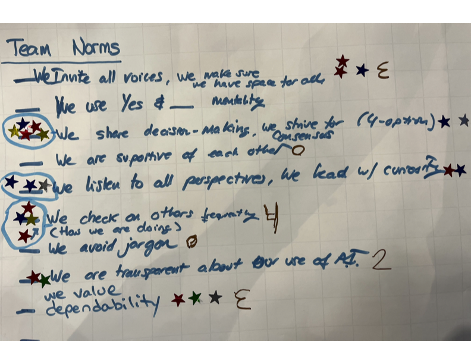

# Cross-Cutting Data Interoperability & Harmonization Innovation Summit 2025 — Group 18

<a href="https://github.com/CU-ESIIL/cross-cutting-data-interoperability-harmonization-innovation-summit-2025__18/edit/main/docs/index.md" title="Edit this page">✏️</a>

<!-- =========================================================
HERO (Swap hero.jpg, title, strapline, and the three links)
========================================================= -->

[Raw photo location: assets/esiil_art/paperclip.png](https://github.com/CU-ESIIL/cross-cutting-data-interoperability-harmonization-innovation-summit-2025__18/blob/main/docs/assets/esiil_art/paperclip.png)

**One sentence on impact:** In three days, Group 18 is prototyping cross-cutting interoperability workflows that let partners combine climate, ecological, and social datasets without friction.

**[Summit concept note (PDF)](assets/Seven%20ways%20to%20measure%20fire%20polygon%20velocity-4.pdfa) · [View shared code](https://github.com/CU-ESIIL/cross-cutting-data-interoperability-harmonization-innovation-summit-2025__18/blob/main/code/single_hull_demo.py) · [Explore data](https://github.com/CU-ESIIL/cross-cutting-data-interoperability-harmonization-innovation-summit-2025__18/blob/main/code/prism_quicklook.py)**

> **About this site:** This is a living notebook for the Cross-Cutting Data Interoperability & Harmonization Innovation Summit 2025. Group 18 captures decisions, visuals, and code here so partners can follow along in real time.

---

## How to use this page (for the team)
- **Edit this file:** `docs/index.md` → ✎ → change text → **Commit changes**.
- **Add images:** upload to `docs/assets/` and reference like `assets/your_file.png`.
- Keep **text short** and **visuals first**. Think “slide captions,” not essays.

---

## Day 1 — Define & Explore
*Focus: questions, hypotheses, context; add at least one visual (photo of whiteboard/notes).*

### Our product 📣
-A call to action for broader community change/standards
- a paper for standards in metadata to future-proof data to ensure future utility. We can't imagine what our data can be useful for in the future. How can we generalize across our disciplines? Maybe special issue Environmental Data Science, ideas by Nov 2025, full article by spring 2026
- an open source tool that translates the academic paper

### Our question(s) 📣
- Can we use AI/LLMs for identifying if datasets are fit for use?
- Can we do a review of the metadata standards that exist for FAIR data principles or siloed projects (coping with FAIR Maricela)
- We have to behave differently before we can even get to FAIR

### Hypotheses / intentions
- usefulness of data goes down and cost goes up
- museum/library/archival perspective on data accessibility over time versus data scientist view on data is "useful/accessible" for 5 years max

### Why this matters (the “upshot”) 📣
- in order to operationalize FAIR we have to have community standards that everyone adheres to (DARE?)
- for such a data centric group
- data isn't "useful" broadly to the community
- standardizing the standards
- there's no problem that's not interdisciplinary, it might be better if we have broader community standards

### Inspirations (papers, datasets, tools)
- Publication: [The FAIR Guiding Principles](https://www.nature.com/articles/sdata201618)
- Dataset portal: [EPA Environmental Dataset Gateway](https://edg.epa.gov/)
- Tool/tech: [Pangeo Forge](https://pangeo-forge.org/)

### Field notes / visuals
<!-- EDIT: Replace with a real smartphone photo or sketch; keep filename simple. -->

[Raw photo location: assets/our_norms.png](https://github.com/CU-ESIIL/cross-cutting-data-interoperability-harmonization-innovation-summit-2025__18/blob/main/docs/assets/our_norms.png)
*Caption: Mapping current interoperability pain points, user stories, and priority partners for Group 18.*

> **Different perspectives:** Briefly capture disagreements or alternate framings. These can unlock innovation.

---

## Day 2 — Data & Methods
*Focus: what we’re testing and building; show a first visual (plot/map/screenshot/GIF).*

### Data sources we’re exploring 📣
<!-- EDIT: Link each source; add size/notes if relevant. -->
- **Source A**

- **NOAA Climate Data Online (CDO)** — hourly precipitation and temperature summaries that we will harmonize with partner-held observations.

  
  [Raw photo location: explore_data_plot.png](https://github.com/CU-ESIIL/cross-cutting-data-interoperability-harmonization-innovation-summit-2025__18/blob/main/docs/assets/explore_data_plot.png)
  *Snapshot highlighting how CDO variables vary across pilot watersheds.*

- **USGS Water Services API** — near real-time streamflow indicators to pair with ecological and community datasets for interoperability testing.

### Methods / technologies we’re testing 📣
- Approach 1 (e.g., time-series break detection)
- Approach 2 (e.g., random forest on features)
- Visualization (e.g., map tiles, small multiples)

### Challenges identified
- Data gaps / quality issues
- Method limitations / compute constraints
- Open questions we need to decide on

### Visuals
<!-- EDIT: Swap examples; keep file sizes modest. -->
#### Static figure

[Raw photo location: figure1.png](https://github.com/CU-ESIIL/cross-cutting-data-interoperability-harmonization-innovation-summit-2025__18/blob/main/docs/assets/figure1.png)
*Figure 1.* One line on what this suggests.

#### Animated change (GIF)

[Raw photo location: change.gif](https://github.com/CU-ESIIL/cross-cutting-data-interoperability-harmonization-innovation-summit-2025__18/blob/main/docs/assets/change.gif)
*Figure 2.* One line on what changes across time.

#### Interactive map (iframe)
<iframe
  title="Interoperability pilot area (OpenStreetMap)"
  src="https://www.openstreetmap.org/export/embed.html?bbox=-105.35%2C39.90%2C-105.10%2C40.10&layer=mapnik&marker=40.000%2C-105.225"
  width="100%" height="360" frameborder="0"></iframe>

<a href="https://www.openstreetmap.org/?mlat=40.000&mlon=-105.225#map=12/40.0000/-105.2250">Open full map</a>

> If an embed doesn’t load, put the normal link directly under it.

---

## Final Share Out — Insights & Sharing 
*Focus: synthesis; highlight 2–3 visuals that tell the story; keep text crisp. Practice a 2-minute walkthrough of the homepage 📣: Why → Questions → Data/Methods → Findings → Next.*

[Raw photo location: team_photo.jpg](https://github.com/CU-ESIIL/cross-cutting-data-interoperability-harmonization-innovation-summit-2025__18/blob/main/docs/assets/team_photo.jpg)

### Findings at a glance 📣
<!-- EDIT: 2–4 bullets, each a headline in plain language with a number if possible. -->
- Headline 1 — what, where, how much
- Headline 2 — change/trend/contrast
- Headline 3 — implication for practice or policy

### Visuals that tell the story 📣
<!-- EDIT: Swap visuals; prioritize clarity. -->

[Raw photo location: fire_hull.png](https://github.com/CU-ESIIL/cross-cutting-data-interoperability-harmonization-innovation-summit-2025__18/blob/main/docs/assets/fire_hull.png)
*Visual 1.* Swap in the primary graphic that clearly communicates your core takeaway.

[Raw photo location: hull_panels.png](https://github.com/CU-ESIIL/cross-cutting-data-interoperability-harmonization-innovation-summit-2025__18/blob/main/docs/assets/hull_panels.png)
*Visual 2.* Use a complementary panel, collage, or set of snapshots that reinforces supporting evidence.

[Raw photo location: main_result.png](https://github.com/CU-ESIIL/cross-cutting-data-interoperability-harmonization-innovation-summit-2025__18/blob/main/docs/assets/main_result.png)
*Visual 3.* Highlight an additional visual that captures a secondary insight or next step.

<iframe
  title="Short explainer video (optional)"
  width="100%" height="360"
  src="https://www.youtube.com/embed/ASTGFZ0d6Ps"
  frameborder="0" allow="accelerometer; autoplay; clipboard-write; encrypted-media; gyroscope; picture-in-picture; web-share"
  allowfullscreen></iframe>

### What’s next? 📣
- Immediate follow-ups
- What we would do with one more week/month
- Who should see this next

---

## Featured links (image buttons)
<!-- EDIT: Replace images/links; keep alt text meaningful and motion subtle. -->
<table>
<tr>
<td align="center" width="33%">
  <a href="assets/Seven%20ways%20to%20measure%20fire%20polygon%20velocity-4.pdfa"> <strong>Read the brief</strong></a>
</td>
<td align="center" width="33%">
  <a href="https://github.com/CU-ESIIL/cross-cutting-data-interoperability-harmonization-innovation-summit-2025__18/blob/main/code/single_hull_demo.py"> <strong>View code</strong></a>
</td>
<td align="center" width="33%">
  <a href="https://github.com/CU-ESIIL/cross-cutting-data-interoperability-harmonization-innovation-summit-2025__18/blob/main/code/prism_quicklook.py"> <strong>Explore data</strong></a>
</td>
</tr>
</table>

---

## Team
| Name | Role | Contact | GitHub |
|------|------|---------|--------|
| Jane Doe | Lead | jane.doe@example.org | @janedoe |
| John Smith | Analyst | john.smith@example.org | @jsmith |

---

## Storage

Code
Keep shared scripts, notebooks, and utilities in the [`code/`](https://github.com/CU-ESIIL/cross-cutting-data-interoperability-harmonization-innovation-summit-2025__18/tree/main/code) directory. Document how to run them in a README or within the files so teammates and visitors can reproduce your workflow.

Documentation
Use the [`docs/`](https://github.com/CU-ESIIL/cross-cutting-data-interoperability-harmonization-innovation-summit-2025__18/tree/main/docs) folder to publish project updates on this site. Longer internal notes can live in [`documentation/`](https://github.com/CU-ESIIL/cross-cutting-data-interoperability-harmonization-innovation-summit-2025__18/tree/main/documentation); summarize key takeaways here so the public story stays current.

---

## Cite & reuse
If you use these materials, please cite:

> ESIIL Innovation Summit Team 18. (2025). *Cross-Cutting Data Interoperability & Harmonization Innovation Summit 2025 — Group 18*. https://github.com/CU-ESIIL/cross-cutting-data-interoperability-harmonization-innovation-summit-2025__18

License: CC-BY-4.0 unless noted. See dataset licenses on the **[Data](data.md)** page.

---

<!-- EDIT HINTS
- Upload images to docs/assets/ and reference as assets/filename.png
- Keep images ~1200 px wide; avoid >5–8 MB per file.
- Use short, active sentences; this is a scrolling “slide deck.”
- Update this page at least once per day during the sprint.
-->
